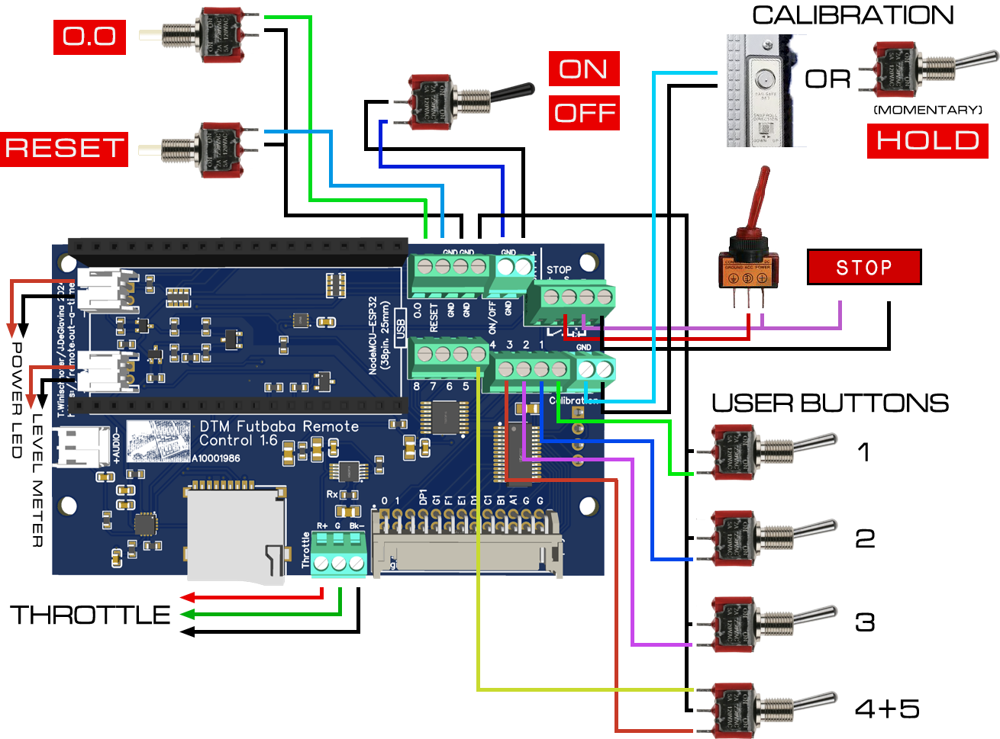

## Futaba Control Board

For detailed information of connectors and features, see [here](../FUTABA.md)

To have [JCLPCB](https://jlcpcb.com) make your Futaba Control Board:
1) Create an account at jlcpcb.com
2) Click "Upload Gerber file" or "order now"
3) Upload the Gerber file (.zip, do not decompress!); leave all options at their defaults. You can choose a PCB color though...
4) Activate "PCB assembly", click "NEXT"
5) Enjoy a view of the PCB, click "NEXT"
6) Upload the BOM and "PickAndPlace" (CPL) files, click "Process BOM & CPL"
7) Enjoy a nice 2D or 3D view of your future board, click "NEXT". (If the display stalls at "Processing files", click "NEXT" regardless).
8) Select a "product description" (eg. "Movie prop") and click "Save to cart". Then finalize your order.

JLC probably won't have the battery monitor IC LC709204FXE-01TBG (U4) in stock. Either you pre-order this, or order the board without the battery monitor feature. It is fully functional otherwise.

For battery monitoring, a JST PH connector (S2B-PH-K-S(LF)(SN), LCSC part number C173752) needs to be soldered on the bottom of the PCB.
