## Hardware

This document contains information on buttons/switches as well as instructions on how to modify your Futaba remote control to work with the kit Control Board.

### Button/switch mapping

The firmware has the following minimum requirements:
- Power switch (fake power; maintained)
- Buttons "O.O" and "RESET" (various functions; momentary)
- Calibration button (momentary)

Additionally, up to eight "User Buttons" can be installed, used for audio playback and/or MQTT messaging.

Power, "O.O" and "RESET" are on the Unibox. This leaves Calibration and, optionally, User Buttons to assign.

"UP/DOWN" and "HOLD" on the Unibox are free to use; however, one of those should be used as a real power switch, separating the battery from the Control Board (unless you want to power down your Futaba prop by pulling out the USB cable from the battery). The other can, for instance, be equipped with a 3-position momentary flat handle mini toggle switch, provide two momentary connections, one of which can be "Calibration", the other a User Button. 

You can also wire the "Fail Safe Set" button on the Futaba as "Calibration", and/or use the Futaba's toggle switches on the top and front as User Buttons.

Example schematics:

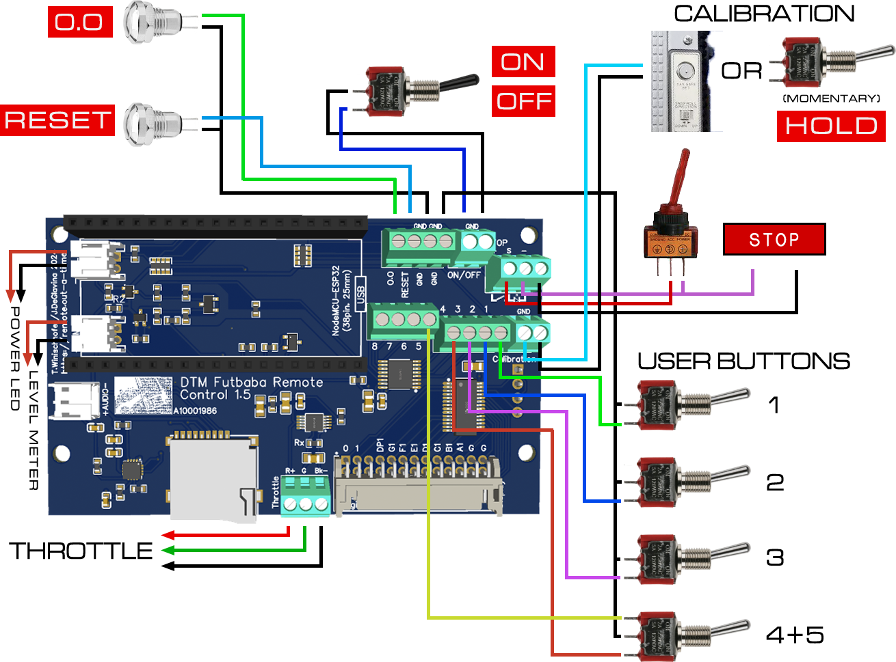

### How to take apart the Futaba remote control

The following instructions only apply to models FP-T8SGA-P and FP-T8SGH-P.

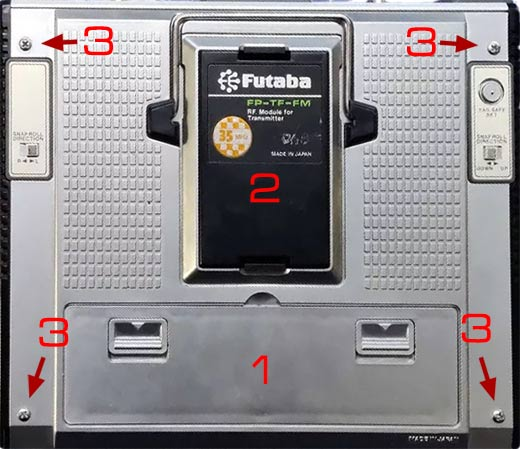

1) Remove the cover of the adjustment panel (1) on the back
2) Remove the transmitter module (2); it is held by two clips at top and bottom
3) Remove the four silver screws (3) on the back and remove back cover

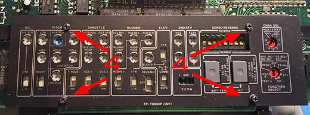

4) Remove four black screws (4) on the adjustment panel, and remove the bezel

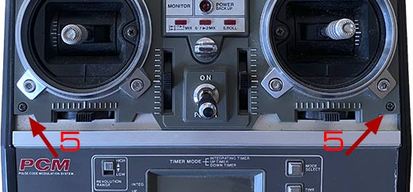

5) Remove two black screws (5) on the front, in the outer corners of the lever controls, and note which screw goes into which hole (they are different)

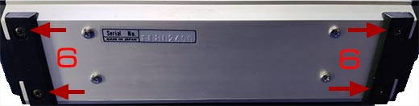

6) Remove four black screws (6) on the bottom

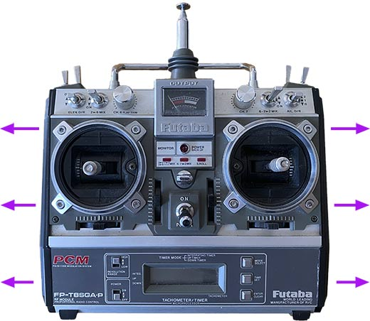

7) Pull out side parts; the small switch panels can be pulled out of the side parts easily.

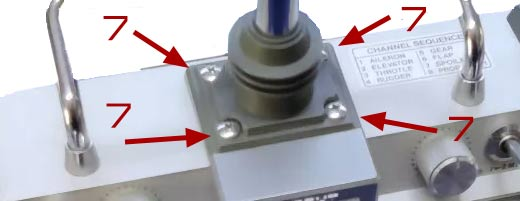

9) Remove four silver screws (7) around the antenna, and pull out the antenna as far as the wire permits

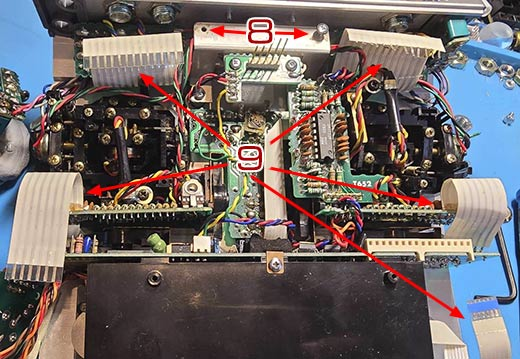

10) Remove two silver screws (8) on the top of the main PCB
11) Remove five ribbon cables (9) on the main PCB
12) Lift main PCB; at this point, it is held by only pin sockets that connect it to other PCBs; you can't pull it out entirely because it is connected to other parts by wires. Just pull it out and downwards, that way you can access all relevant parts.

Now you can access the potentiometer to patch in black-green-red wires in order to connect this pot to the kit's Control Board, as well as all switches and buttons you may want to connect to said Control board.

It is recommended to remove the battery. It is heavy, removing it makes the finished prop easier to handle. Also, since the the Remote, after the modifications, can't be used normally anyway, there is no point in keeping a battery in it.

### Throttle connection

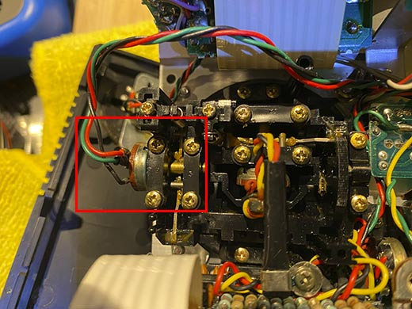

Desolder the red/green/black wires from the pot, located top left hand side (looking at it from the back), and attach new ones to connect the pot to the Control Board. The connector on the Control Board is marked R, G, Bk, matching the original wire colors.

Please note that the kit electronics are designed for models FP-T8SGA-P and FP-T8SGH-P, which use a 5k pot and resistancies of 1.8k through 3k for the throttle. If you are using a different model, the electronics might need modifications. Please contact us for more information.

### Button/switch connections

#### Toggle switches

Note that using the Futaba's original front and top toggle switches is entirely optional, and doing it is not trivial. They would serve as User Buttons for audio playback and MQTT messages.

If you do not wish to use your Futaba's toggle switches, you can use the "UP/DOWN" and "HOLD" switches on the Unibox instead; you can install three-position momentary switches there and have four User Buttons as a result.

If you want to wire the toggle switches from the Futaba remote control to the Control Board, it is recommended to use a common GND wire. This GND wire connects all center pins of all switches to each other and to the GND screw connector on the Control Board.

Some of the toggle switches on the Futaba are interconnected, such as the ones on top, left hand side (when viewed from the back). Check the traces of the PCBs, desoldering or cutting-off components or wire bridges might be required. The switches must be working independingly, otherwise proper operation might be hindered.

Important: Do not re-connect the two widest ribbon cables (top two ones) to the main PCB when re-assembling the remote; other parts of the original circuit might interfere with toggle switch operation.

#### Calibration

The "Fail Safe Set" button on the back makes an excellent "Calibration" button. Desolder the green and yellow wires, and connect your new wires to the Control Board in their place:

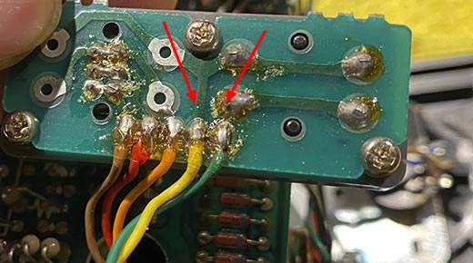

### Power LED

The power LED is a bit tricky to reach, Its solder points are on the center PCB, below the power meter, under a "flying" pot that looks like a white square. You can bend up that pot to reach the solder points. Left is GND, right is VCC (when viewed from the back). Don't forget to bend the pot back after soldering, otherwise you can't put in the antenna.

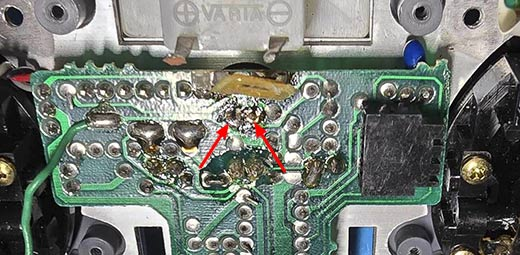

### Wires

The wires need to lead out of the Futaba's body. One way to do this is to dremel off the back cover a bit to make room, as shown in the picture. This requires bending the top part of the inner shielding upward (or breaking it off) to make room for the wires in the corners.

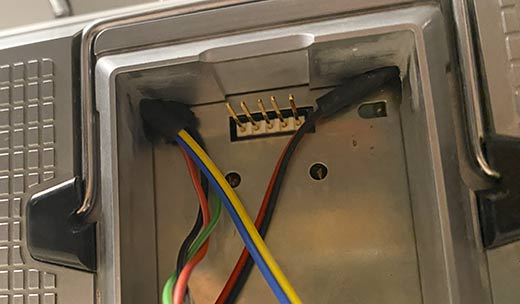
