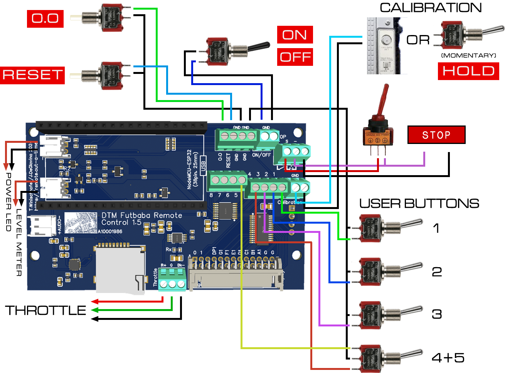
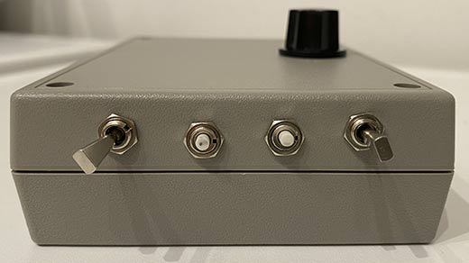
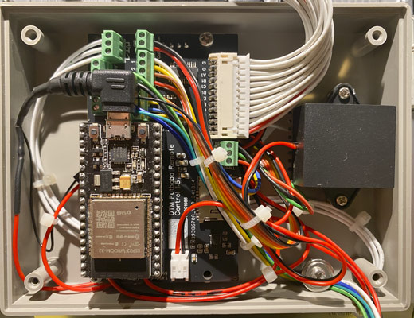

## Hardware

This document contains instructions on how to modify your Futaba remote control.

The Control Board, which is put in the grey box ("Unibox"), has the following connectors:
- [Throttle](throttle-connection) from Futaba
- [Power LED](#power-led) from Futaba
- [Battey Level Meter](#battery-level-meter) from Futaba
- Fake Power (switch)
- [Calibration](#calibration) (button)
- Buttons "O.O" and "RESET"
- 8 User Buttons (buttons or switches)
- Speaker

### Button/switch mapping

The firmware has the following minimum requirements:
- Fake Power switch (maintained)
- Buttons "O.O" and "RESET" (various functions; momentary)
- Calibration button (momentary)

Additionally, up to eight "User Buttons" can be installed, used for audio playback and/or MQTT messaging. These "buttons" can be momentary or maintained contacts. (_"Momentary switches"_ are switches which only remain in their _on_ state as long as they're being actuated (pressed, held), for example a push button. A _"maintained switch"_ changes state when actuated, and stays in that state until actuated again, for example a toggle switch. Maintained switches are specified using terms like "ON-OFF" or "ON-OFF-ON", while momentary switches use terms like "(ON)-OFF" or "(ON)-OFF-(ON)". The parentheses symbolize a momentary contact. ON-OFF means a 2 position switch, while ON-OFF-ON is a 3 position switch, with _off_ in the middle.) 

Fake power (labeled "ON/OFF"), "O.O" and "RESET" are on the Unibox. This leaves Calibration and, optionally, User Buttons to assign.

"UP/DOWN" and "HOLD" on the Unibox are free to use; however, one of those should be used as a real power switch, separating the battery from the Control Board. The other can, for instance, be equipped with a 3-position (ON)-OFF-(ON) or ON-OFF-(ON) flat handle mini toggle switch, serving as "Calibration" (on the momentary side) and one User Button. 

I used "UP/DOWN" for (real) power (ON-OFF type switch), and a (ON)-OFF-(ON) switch as "HOLD", serving as User Buttons #1 and #2.

If you are willing to modify your Futaba beyond connecting the throttle pot, you can also wire its "Fail Safe Set" button as "Calibration", and/or use the Futaba's toggle switches on the top and front as User Buttons.

The User Buttons/Switches in the following schematics are examples. 

The switch for User Button 4 and 5 in above example must be a three-position switch with OFF in the middle.

### How to take apart the Futaba remote control

The following instructions only apply to models FP-T8SGA-P and FP-T8SGH-P.

1) Remove the cover of the adjustment panel (1) on the back
2) Remove the transmitter module (2); it is held by two clips at top and bottom
3) Remove the four silver screws (3) on the back and remove back cover

4) Remove four black screws (4) on the adjustment panel, and remove the bezel

5) Remove two black screws (5) on the front, in the outer corners of the lever controls, and note which screw goes into which hole (they are different)

6) Remove four black screws (6) on the bottom

7) Pull out side parts; the small switch panels can be pulled out of the side parts easily.

9) Remove four silver screws (7) around the antenna, and pull out the antenna as far as the wire permits; you could as well cut off that wire since the antenna isn't used.

10) Remove two silver screws (8) on the top of the main PCB
11) Unplug five ribbon cables (9) on the main PCB
12) Lift out the main PCB; at this point, it is held by only pin sockets that connect it to other PCBs. 

Now you can access the throttle potentiometer to patch in black-green-red wires in order to connect this pot to the kit's Control Board, as well as all switches and buttons you may want to connect to said Control board.

Even if you do not plan on putting a battery for the mod kit inside the Futaba, it is recommended to remove the Futaba's original battery. It is heavy, removing it makes the finished prop easier to handle. Also, since the the Remote, after the modifications, can't be used normally anyway, there is no point in keeping a battery in it. 

### Throttle connection

Desolder the red/green/black wires from the pot, located top left hand side (looking at it from the back), and attach new ones to connect the pot to the Control Board. The connector on the Control Board is marked R, G, Bk, matching the original wire colors.

Please note that the kit electronics are designed for models FP-T8SGA-P and FP-T8SGH-P, which use a 5k pot and resistancies of 1.8k through 3k for the throttle. If you are using a different model, the electronics might need modifications. Please contact us for more information.

### Button/switch connections

#### Toggle switches

Note that using the Futaba's original front and top toggle switches is entirely optional, and doing it is not trivial. They would serve as User Buttons for audio playback and MQTT messages.

If you want to wire the toggle switches from the Futaba remote control to the Control Board, it is recommended to use a common GND wire. This common GND wire connects all center pins of all switches to each other and to one of the GND screw connectors on the Control Board.

Some of the toggle switches on the Futaba are interconnected through their PCBs, such as the ones on top, left hand side (when viewed from the back). Check the traces on the PCBs, desoldering or cutting-off components or wire bridges might be required. The switches must be working independingly, otherwise proper operation might be hindered.

Important: Do not re-connect the two widest ribbon cables (top two ones) to the main PCB when re-assembling the remote; other parts of the original circuit might interfere with toggle switch operation.

#### Calibration

The "Fail Safe Set" button on the back makes an excellent "Calibration" button. Desolder the green and yellow wires, and connect your new wires to the Control Board in their place:

### Power LED

Connecting the Control Board to the Futaba's power LED is optional, and this LED is a bit tricky to access, Its solder points are on the center PCB, below the power meter, under a "flying" pot that looks like a white square. You can bend up that pot to reach the solder points. Left is GND, right is VCC (when viewed from the back). You need to cut the traces on that PCB that lead away from the LED's solder points because the remaining circuit might interfere with LED operation.

Don't forget to bend the "flying pot" back after soldering, otherwise you can't put in the antenna.

### Battery Level Meter

Connecting the Control Board to the Futaba's level meter is, of course, optional. As far as I could make out, it is never showing anything but "zero" in the movie. In order to connect it to the Control Board, solder two wires to the meter's contact like shown below.

### Wires

The wires need to lead out of the Futaba's body. 

#### The "whole 9 yards" way

Since I needed some space for my battery's charging electronics (see below), I decided to leave out the main PCB entirely. This has one caveat: The antenna needs unobstructed space for movement, which means you need to take care of all the wires that might come in the way.

#### The "soft" way

The less intrusive/destructive way (ie keep the main PCB in) is to dremel off the back cover a bit to make room, as shown in the picture. This requires bending the top part of the inner shielding upward (or breaking it off) to make room for the wires in the corners.

#### The way out

The final step is to take apart the transmission module, and only insert the lid into the slot.

### Power supply

The prop is powered by a 5V battery, connected to the USB port of the ESP32 board on top of the Control Board. It should be able to deliver 1A, and have a capacity of >= 2500mAh.

Depending on the shape of the battery, it can be mounted under the Unibox (instead of the second set of 9V batteries), or inside the Futaba, in place of the Futaba's original battery. In the latter case, access to the battery for charging has to be provided, since the Futaba's battery compartment is not accessible without major disassembly. One way to do this is to use two pins of the existing charging connector, or the "tachometer" connector.

I used this battery, which I sourced from AliExpress:

With a simple modification, it has the perfect measurements to fit into the original battery compartment. The charging electronics need to be put elsewhere, otherwise it's too thick. Remove the blue shrink-wrap, the tape below, and the PCB is free. I taped it on top of the battery compartment:

The charging wire is - through a micro-USB plug, center bottom of above picture - connected to the "tachometer" connector on the Futaba. A JST XH or Dupont 3-pin connector fits fine, so it's easy to make a charging adapter for any kind of power supply. (I used the center pin for + and the two outer pins for -, that way orientation of the plug does not matter. The black wire on the small Futaba PCB is +, yellow and orange are -.

The actual power cable for the kit electronics is lead outside, together with the other wires from the switches.

### "Stop" light and switch

Many people use tape to attach the Molex light and the switch. Given the small area of contact and the Futaba's checkered surface, I used tape and M2 screws.

The left screw is a machine screw with a nut, the other is a plastic screw (as there is no room for a nut inside the light).

Attaching the switch that way requires disassembling it, removing the small bulb, and cutting out the black inner body to make room for the screw heads:

The position of the Stop switch in the movie: (There were several Futabas used, all slightly different. This is the one used for the later close-ups.)

### Mounting the Unibox on the Futaba

Since the transmitter module's lid is slightly loose, I decided to attach the Unibox using 6mm PCB standoffs:

The vertical position in the movie:

### The Unibox

Apart from the "UP/DOWN" switch (which I use as a real power switch), all switches and buttons have a common ground (black). The two red wires are from the "UP/DOWN" switch and will be connected to + of the ESP32, and + from the battery.

The switches are positioned and rotated as in the movie, as far as I could make out:

With everything wired up; it looks more chaotic than it is. The black square on the right hand side is the speaker.

_To be continued._

_Text & images: (C) Thomas Winischhofer ("A10001986"). See LICENSE._ Source: https://remote.out-a-ti.me

