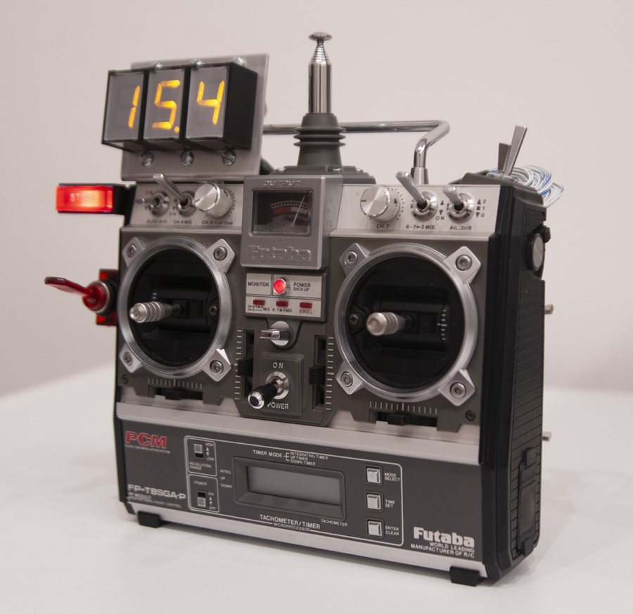
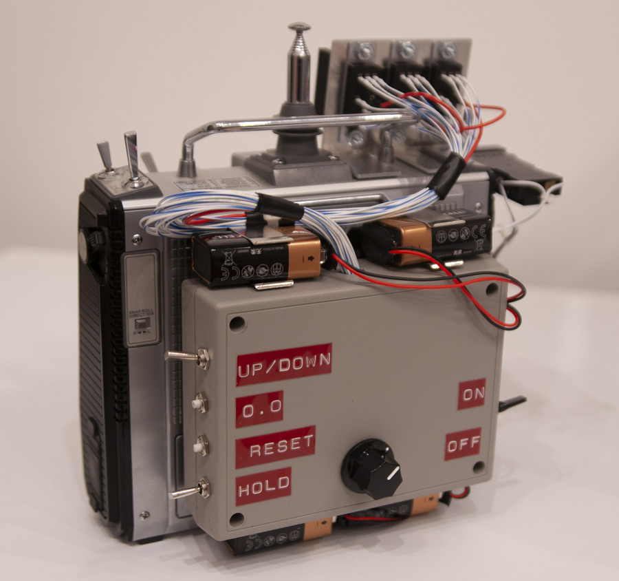
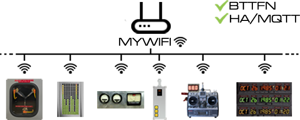
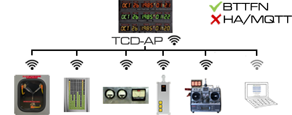
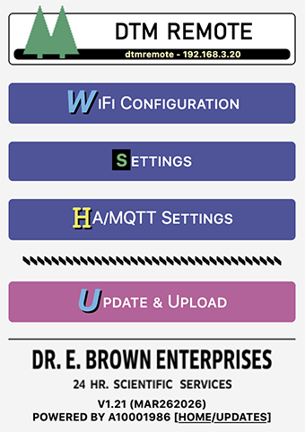
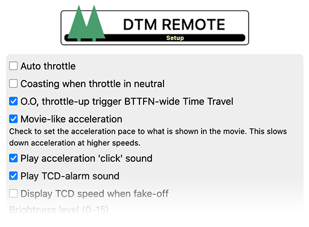
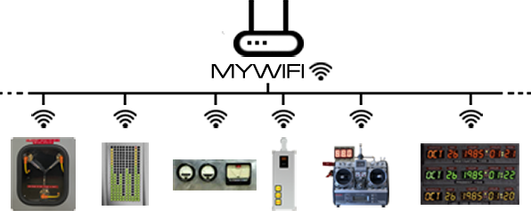
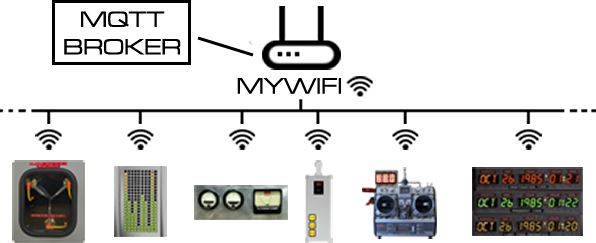
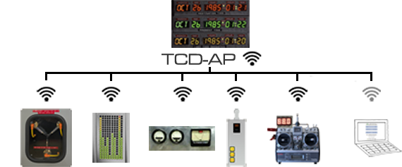

# Remote Control (Delorean Time Machine)

This [repository](https://remote.out-a-ti.me) holds the most current firmware for CircuitSetup's [Futaba remote control kit](https://circuitsetup.us/product/futaba-remote-stanley-display-wireless-control-kit/), meant mainly for use in combination with a CircuitSetup [Time Circuits Display](https://tcd.out-a-ti.me) with a connected speedo. Of course, the Remote can also be used stand-alone.

See [here](FUTABA.md) for information on the hardware (parts, disassembly & building instructions).

|  |
|:--:|
| See it in action. Click to watch the video |

See it controlling the lights and blinds through Home Assistant:

|  |
|:--:|
| Click to watch the video |

A video of an early proof-of-concept is [here](https://www.facebook.com/61553801874212/videos/1047035620236271/) (note that the hardware shown isn't even in prototype stage).

Firmware features:
- [Wireless communication](#connecting-a-time-circuits-display) with [Time Circuits Display](https://tcd.out-a-ti.me); when (fake) powered up by "ON/OFF" switch, the Remote will take over speed control on the TCD-connected speedo. 
- Elevator stick on actual Futaba remote control used for throttle control, like in the movie. The throttle can increase or decrease speed, in five steps towards each direction. When the speed on the TCD's speedo reaches 88mph, a time travel is triggered.
- Optional [coasting](#-coasting-when-throttle-in-neutral), optional [auto-throttle](#-auto-throttle)
- Supports controlling the Futaba's power LED and battery level meter (static display only, no actual battery level display)
- Movie-accurate "Stop" light and stop switch behavior
- Movie-accurate sound effects
- Eight optional "[User Buttons](#user-buttons)" for playback of user-provided sound effects and/or sending user-configurable [Home Assistant/MQTT](#home-assistant--mqtt) messages
- [SD card](#sd-card) support for custom audio files for effects, and music for the Music Player
- [Music player](#the-music-player): Play mp3 files located on an SD card, controlled by the "O.O"/"RESET" buttons or [Time Circuits Display](https://tcd.out-a-ti.me) keypad via BTTFN
- Advanced network-accessible [Config Portal](#the-config-portal) for setup (http://dtmremote.local, hostname configurable)
- [Home Assistant](#home-assistant--mqtt) (MQTT 3.1.1) support
- Smart battery monitoring for certain LiPo batteries (requires M-version Control Board, or non-M-board with BatMon add-on)
- Built-in OTA installer for firmware updates and audio files

## Firmware Installation

If a previous version of the Remote firmware is installed on your device, you can update easily using the pre-compiled binary. Enter the [Config Portal](#the-config-portal), click on "Update" and select the pre-compiled binary file provided in this repository ([install/remote-A10001986.ino.nodemcu-32s.bin](https://github.com/realA10001986/Remote/blob/main/install/remote-A10001986.ino.nodemcu-32s.bin)). 

If you are using a fresh ESP32 board, please see [remote-A10001986.ino](https://github.com/realA10001986/Remote/blob/main/remote-A10001986/remote-A10001986.ino) for detailed build and upload information, or, if you don't want to deal with source code, compilers and all that nerd stuff, go [here](https://install.out-a-ti.me) and follow the instructions.

*Important: After a firmware update, the "wait" symbol might be shown a while longer while booting. Do NOT unplug or switch off the device during this time.*

### Sound-pack installation

The firmware comes with a sound-pack which needs to be installed separately. The sound-pack is not updated as often as the firmware itself. If you have previously installed the latest version of the sound-pack, you normally don't have to re-install it when you update the firmware. Only if the Remote displays "AUD" briefly during boot, a re-installation/update of the sound-pack is needed.

The first step is to download "install/sound-pack-xxxxxxxx.zip" and extract it. It contains one file named "REMA.bin".

Then there are two alternative ways to proceed. Note that both methods *require an SD card*.

1) Through the [Config Portal](#the-config-portal). Click on *Update*, select the "REMA.bin" file in the bottom file selector and click on *Upload*.

2) Via SD card:
- Copy "REMA.bin" to the root directory of a FAT32 formatted SD card;
- power down the Remote,
- insert this SD card into the slot and 
- power up the Remote; the sound-pack will be installed automatically.

After installation, the SD card can be re-used for [other purposes](#sd-card).

## Initial Configuration

>The following instructions only need to be followed once, on fresh Remotes. They do not need to be repeated after a firmware update.

The first step is to establish access to the Remote's configuration web site ("Config Portal") in order to configure your device:

- Power up your Remote and wait until it has finished booting.
- Connect your computer or handheld device to the WiFi network "REM-AP".
- Navigate your browser to http://dtmremote.local or http://192.168.4.1 to enter the Config Portal.

### Connecting to a WiFi network

Your Remote knows two ways of WiFi operation: Either it creates its own WiFi network, or it connects to a pre-existing WiFi network.

As long as your Remote is unconfigured, it creates its own WiFi network named "REM-AP". This mode of operation is called "**Access point mode**", or **"AP-mode"**. In this mode, computers/handhelds can connect to your Remote in order to access the Config Portal, but ways of communication end right here. There is no inter-prop-communication ([BTTFN](#bttf-network-bttfn)) and no [HA/MQTT](#home-assistant--mqtt).

It is ok to leave it in AP-mode, predominantly if used stand-alone. To keep operating your Remote in AP-mode, simply _do not configure_ a WiFi network connection as described below.

More...

>Please do not leave computers/handhelds permanently connected to the Remote in AP-mode. These devices might think they are connected to the internet and therefore hammer your Remote with DNS and HTTP requests which might lead to disruptions.

>If you wish for your device to remain in AP-mode, please select a suitable WiFi channel on the Config Portal's "WiFi Configuration" page. See [here](#-wifi-channel).

> In AP-mode, the SID can switch off WiFi to save power. See [here](#wifi-power-saving-features).

#### Home setup with a pre-existing local WiFi network

In this case, you can connect your Remote to your home WiFi network. This allows for inter-prop-communication ([BTTFN](#bttf-network-bttfn)) and [HA/MQTT](#home-assistant--mqtt).

Click on "WiFi Configuration" and either select a network from the top of the page or enter a WiFi network name (SSID), and enter your WiFi password. After saving the WiFi network settings, your Remote reboots and tries to connect to your selected WiFi network. 

More...

  
>Your Remote requests an IP address via DHCP, unless you entered valid data in the fields for static IP addresses (IP, gateway, netmask, DNS). If the device is inaccessible as a result of incorrect static IPs, 
>- power-down the device,
>- hold the Calibration button,
>- power-up the device (while still holding the Calibration button)
>- wait until the displays shows a circle animation,
>- press Button "O.O" twice within 10 seconds,
>- wait until the display shows "RST",
>- then release the Calibration button.
>
>This procedure causes static IP data to be deleted; the device will return to DHCP after a reboot.

If the Remote fails to connect, it falls back to AP-mode. You can trigger another [connection attempt](#-attempt-re-connection-on-fake-power) by fake-powering it down and up.

#### Places without a WiFi network

In this case and with no [Time Circuits Display](https://tcd.out-a-ti.me) at hand, keep your Remote operating in AP-mode.

If you have a TCD, you can connect your Remote to the TCD's own WiFi network: 

This setup is meant for cars, but suitable for any place with no WiFi network. See [here](#car-setup) for details.

After completing WiFi setup, your Remote is ready for use; you can also continue configuring it to your personal preferences through the Config Portal.

## The Config Portal

The "Config Portal" is the Remote's configuration web site. 

|  |
|:--:| 
| *The Config Portal's main page* |

It can be accessed as follows:

#### If Remote is in AP mode

- Connect your computer or handheld device to the WiFi network "REM-AP".
- Navigate your browser to http://dtmremote.local or http://192.168.4.1 to enter the Config Portal.
- (For proper operation, please disconnect your computer or handheld from REM-AP when you are done with configuring your Remote. These devices can cause high network traffic, resulting in severe performance penalties.)

#### If Remote is connected to a WiFi network

- Connect your handheld/computer to the same (WiFi) network to which your Remote is connected.
- Navigate your browser to http://dtmremote.local   

More...

  >Accessing the Config Portal through this address requires the operating system of your handheld/computer to support Bonjour/mDNS: Windows 10 version TH2     (1511) [other sources say 1703] and later, Android 13 and later; MacOS and iOS since the dawn of time.

  >If connecting to http://dtmremote.local fails due to a name resolution error, you need to find out the Remote's IP address: Power up and fake-power-up the Remote and hold the Calibration button for 2 seconds. The Remote will display its current IP address (a. - b. - c. - d). Then, on your handheld or computer, navigate to http://a.b.c.d (a.b.c.d being the IP address as displayed on the Remote) in order to enter the Config Portal.

In the main menu, click on "Settings" to configure your Remote. 

|  |
|:--:| 
| *Click for full screenshot* |

A full reference of the Config Portal is [here](#appendix-a-the-config-portal).

## Basic Operation

After [calibration](#calibration), your Remote is ready for use. 

If battery monitoring is available, the battery state (in percent, or "FUL") is shown briefly upon (real) power-on.

After fake-power-on, the Remote's throttle controls the TCD's speed (ie the speed displayed on the Speedo). 

For acceleration, there are two modes: Linear mode and "movie mode". In linear mode, acceleration is even over the entire range of 0 to 88mph. In "movie mode", the Remote (mostly) accelerates in the same pace as shown in the movie. In this mode, acceleration becomes slower at higher speeds. The mode can be selected in the Config Portal, or through the TCD's keypad (7060).

When the remote hits 88.0mph, the TCD triggers a time travel.

Auto-throttle: If this option is checked in the Config Portal (or Auto-Throttle is enabled through the TCD keypad [7062]), acceleration will continue to run after briefly pushing up the throttle stick and releasing it into neutral. Acceleration is stopped when pulling down the throttle stick, or when 88mph is reached.

Coasting: If this feature is enabled through the Config Portal, the Remote will ever so slightly reduce the current speed when the throttle lever is in neutral. Like a car when you put the transmission in neutral or press the clutch.

Buttons and switches:

### "ON/OFF": Fake power

The "ON/OFF" switch turns the Remote on and off in a sense that it takes over speed control on the TCD when fake-powered on, and hands back speed control when fake-powered off.

"ON/OFF" must be a maintained contact.

### "Stop"

The "Stop" switch activates the brakes on your virtual Delorean; if the brakes are on, speed changes on the Remote are not followed by the TCD, instead the TCD will count speed down to 0. Upon releasing the brake, the virtual car accelerates up to the speed shown on the Remote, and will then follow its speed changes.

"Stop" must be a maintained contact.

### Calibration

<table>
  <tr><td></td><td>Short press</td><td>Long press</td></tr>
  <tr><td>Fake-power off</td><td>Calibrate, see below</td><td>Calibration, see below</td></tr>
  <tr><td>Fake-power on</td><td>Reset speed to 0</td><td>Display IP address, battery charge percentage(*), battery time-to-empty(*)</td></tr>
</table>

(* M-board (>= 1.6), or non-M-board (>= 1.6) with BatMon Add-on required; if LiPo battery is properly connected to battery monitor)

The throttle of the Remote needs calibration:

- Put the "ON/OFF" switch in "OFF" position.
- Put the throttle lever in neutral (center) position, press the Calibration button. The display will briefly show "CAL" to show acceptance.
- Hold the Calibration button for >= 2 seconds, "UP" will be displayed. Now push the throttle to the up-most position and press the Calibration button. "DN" will be displayed.
- Pull the throttle lever to the bottom-most position and press the Calibration button. The display will clear, calibration is finished.

If you change power-source (ie a new battery, or power via USB to the ESP32), re-calibration is required.
 
The Calibration button needs to be a momentary contact.

### Buttons "O.O" and "RESET"

When fake power is on:
<table>
  <tr><td></td><td>Short press</td><td>Long press</td></tr>
  <tr><td>Button "O.O"</td><td>Prepare BTTFN-wide TT or <a href="#the-music-player">Music Player</a>: Previous Song (See <a href="#-oo-throttle-up-trigger-bttfn-wide-time-travel">here</a>)</td><td><a href="#the-music-player">Music Player</a>: Play/Stop</td></tr>
  <tr><td>Button "RESET"</td><td><a href="#the-music-player">Music Player</a>: Next Song</td><td><a href="#the-music-player">Music Player</a>: Toggle Shuffle</td></tr>
</table>

When fake power is off, the buttons are used to set up audio volume and display brightness:
<table>
  <tr><td></td><td>Short press</td><td>Long press</td></tr>
  <tr><td>Button "O.O"</td><td>Volume up</td><td>Brightness up</td></tr>
  <tr><td>Button "RESET"</td><td>Volume down</td><td>Brightness down</td></tr>
</table>

### User Buttons

These buttons are entirely optional. You can install any number of buttons, they only serve the purpose of playing back user-provided sound effects and/or send user-configurable messages to an [MQTT](#home-assistant--mqtt) broker.

Sound playback is mapped as follows:

<table>
  <tr><td></td><td>Short press</td><td>Long press</td></tr>
  <tr><td>Button 1</td><td>Play "<a href="#additional-custom-sounds">key1.mp3</a>"</td><td>Play "<a href="#additional-custom-sounds">key1l.mp3</a>"</td></tr>
  <tr><td>Button 2</td><td>Play "<a href="#additional-custom-sounds">key2.mp3</a>"</td><td>Play "<a href="#additional-custom-sounds">key2l.mp3</a>"</td></tr>
  <tr><td>Button 3</td><td>Play "<a href="#additional-custom-sounds">key3.mp3</a>"</td><td>Play "<a href="#additional-custom-sounds">key3l.mp3</a>"</td></tr>
  <tr><td>Button 4</td><td>Play "<a href="#additional-custom-sounds">key4.mp3</a>"</td><td>Play "<a href="#additional-custom-sounds">key4l.mp3</a>"</td></tr>
  <tr><td>Button 5</td><td>Play "<a href="#additional-custom-sounds">key5.mp3</a>"</td><td>Play "<a href="#additional-custom-sounds">key5l.mp3</a>"</td></tr>
  <tr><td>Button 6</td><td>Play "<a href="#additional-custom-sounds">key6.mp3</a>"</td><td>Play "<a href="#additional-custom-sounds">key6l.mp3</a>"</td></tr>
  <tr><td>Button 7</td><td>Play "<a href="#additional-custom-sounds">key7.mp3</a>"</td><td>Play "<a href="#additional-custom-sounds">key7l.mp3</a>"</td></tr>
  <tr><td>Button 8</td><td>Play "<a href="#additional-custom-sounds">key9.mp3</a>"</td><td>Play "<a href="#additional-custom-sounds">key9l.mp3</a>"</td></tr>
</table>

> 'key9' instead of 'key8' is no typo. The seemingly odd numbering is for synchronicity with other props, where keys 2, 5, 8 control the music player. Since the Remote has more buttons free for keyX play-back than other props, 'key2' and 'key5' are supported and only 'key8' is skipped. Note that 'key2', 'key5' as well as the 'keyXl' sounds cannot be played back through a TCD keypad command.

If a "button" is configured as a maintained switch in the Config Portal, keyX will be played on every flip (ON->OFF, OFF->ON) by default. If the option **_Maintained: Audio on ON only_** is checked for a switch, keyX will only be played when the switch is brought into ON position. This is especially useful for three-position switches where each of the "ON" positions is wired to a different "Button" on the Control Board. Note that maintained switches cannot trigger play-back of keyXl.

If the button/switch is pressed/flipped while audio from a previous press/flip of the same button/switch is still playing, play-back will be stopped.
 
## SD card

Preface note on SD cards: For unknown reasons, some SD cards simply do not work with this device. For instance, I had no luck with Sandisk Ultra 32GB and  "Intenso" cards. If your SD card is not recognized, check if it is formatted in FAT32 format (not exFAT!). Also, the size must not exceed 32GB (as larger cards cannot be formatted with FAT32). Transcend, Sandisk Industrial, Verbatim Premium and Samsung Pro Endurance SDHC cards work fine in my experience.

The SD card, apart from being required for [installing](#sound-pack-installation) of the sound-pack, can be used for custom sound effects, substituting built-in sound effects and for music played back by the [Music player](#the-music-player). Also, it is _strongly recommended_ to store [secondary settings](#-save-secondary-settings-on-sd) on the SD card to minimize [Flash Wear](#flash-wear).

Note that the SD card must be inserted before powering up the device. It is not recognized if inserted while the Remote is running. Furthermore, do not remove the SD card while the device is powered.

### Sound substitution

The Remote's built-in sound effects can be substituted by your own sound files on a FAT32-formatted SD card. These files will be played back directly from the SD card during operation, so the SD card has to remain in the slot.

Your replacements need to be put in the root (top-most) directory of the SD card, be in mp3 format (128kbps max) and named as follows:
- "poweron.mp3": Played when the Remote is (fake)-powered on.
- "brakeon.mp3": Played when the brake is switched on (= when the "Stop" light is switched on).
- "alarm.mp3". Played when the alarm sounds (triggered by a Time Circuits Display via BTTFN or MQTT);

### Additional Custom Sounds

The firmware supports some additional user-provided sound effects, which it will load from the SD card. If the respective file is present, it will be used. If that file is absent, no sound will be played.

- "poweroff.mp3": Played when the Remote is (fake)-powered off.
- "brakeoff.mp3": Played when the brake is switched off.
- "key1.mp3", "key2.mp3", "key3.mp3", "key4.mp3", "key5.mp3", "key6.mp3", "key7.mp3", "key9.mp3": Will be played upon pressing the respective [button](#user-buttons), or - with the exceptions of "key2" and "key5" - by typing 700x on the [TCD's keypad](#tcd-remote-command-reference) (connected through BTTFN).
- "key1l.mp3", "key2l.mp3", "key3l.mp3", "key4l.mp3", "key5l.mp3", "key6l.mp3", "key7l.mp3", "key9l.mp3": Will be played upon long-pressing the respective [button](#user-buttons). Naturally, this only works for momentary buttons, not maintained switches.

> The seemingly odd numbering for keyX files is because of synchronicity with other props, especially the TCD and its keymap where the Music Player occupies keys 2, 5, 8. Since there are more buttons for sound than keys, 2 and 5 are used but 8 is skipped.

Those files are not provided here. You can use any mp3, with a bitrate of 128kpbs or less.

### Installing Custom & Replacement Audio Files

Replacements and custom sounds can either be copied to the SD card using a computer (as before), or uploaded through the Config Portal.

Uploading through the Config Portal works exactly like [installing the default audio files](#sound-pack-installation); on the main menu, click "UPDATE". Afterwards choose one or more mp3 files to upload using the bottom file selector, and click "UPLOAD". The firmware will store the uploaded mp3 files on the SD card.

In order to delete a file from the SD card, upload a file whose name is prefixed with "delete-". For example: To delete "key3.mp3" from the SD card, upload a file named "delete-key3.mp3"; the file's contents does not matter, so it's easiest to use a newly created empty file. The firmware detects the "delete-" part and, instead of storing the uploaded file, it throws it away and deletes "key3.mp3" from the SD card.

For technical reasons, the Remote must reboot after mp3 files are uploaded in this way.

Please remember that the maximum bitrate for mp3 files is 128kbps. Also note that the uploaded file is stored to the root folder of the SD card, so this way of uploading cannot be used to upload songs for the Music Player. 

## The Music Player

The firmware contains a simple music player to play mp3 files located on the SD card. 

In order to be recognized, your mp3 files need to be organized in music folders named *music0* through *music9*. The folder number is 0 by default, ie the player starts searching for music in folder *music0*. This folder number can be changed in the Config Portal or through the TCD keypad (705x).

The names of the audio files must only consist of three-digit numbers, starting at 000.mp3, in consecutive order. No numbers should be left out. Each folder can hold up to 1000 files (000.mp3-999.mp3). *The maximum bitrate is 128kpbs.*

Since manually renaming mp3 files is somewhat cumbersome, the firmware can do this for you - provided you can live with the files being sorted in alphabetical order: Just copy your files with their original filenames to the music folder; upon boot or upon selecting a folder containing such files, they will be renamed following the 3-digit name scheme (as mentioned: in alphabetic order). You can also add files to a music folder later, they will be renamed properly; when you do so, delete the file "TCD_DONE.TXT" from the music folder on the SD card so that the firmware knows that something has changed. The renaming process can take a while (10 minutes for 1000 files in bad cases). Mac users are advised to delete the ._ files from the SD before putting it back into the control board as this speeds up the process.

To start and stop music playback, hold "O.O" for 2 seconds. Briefly pressing "O.O" jumps to the previous song, pressing "RESET" to the next one. (The same can be achieved by entering codes on the TCD's keypad: 7002 = previous song, 7005 = play/stop, 7008 = next song).

By default, the songs are played in order, starting at 000.mp3, followed by 001.mp3 and so on. Holding "RESET" toggles Shuffle mode. The power-up Shuffle mode can be set up in the Config Portal.

See [here](#buttons-oo-and-reset) and [here](#tcd-remote-command-reference) for a list of controls of the music player.

While the music player is playing music, other sound effects might be disabled/muted. The TCD-triggered alarm will, if so configured, interrupt the music player.

## Battery monitoring

If a suitable control board is in use, and battery warnings are enabled in the Config Portal, battery state can be monitored, and a warning is issued when the battery is low.

Monitoring can be done through the [Calibration button](#calibration) and the TCD (7091/7092).

The "low battery" warning is given as follows:

- A sound is played once
- If the Futaba's battery level meter is connected and enabled, it is switched off (= it reads 0).
- If the Futaba's original power LED is connected and enabled, it blinks.
- If the power LED is disabled, depending on fake power, either "BAT" is displayed periodically, or the display blinks periodically.

## Connecting a Time Circuits Display

The TCD communicates with the Remote wirelessly, via the built-in "**B**asic-**T**elematics-**T**ransmission-**F**ramework" (BTTFN) over WiFi. Note that a wired connection is not supported.

The actual remote controlling is done wirelessly, and the TCD's keypad can be used to remote-control the Remote (to control the Music Player, for instance).

|  |
|:--:|
| Click to watch the video |

BTTFN requires the props all to be connected to the same network, such as, for example, your home WiFi network. BTTFN does not work over the Internet.

>The term "WiFi network" is used for both "WiFi network" and "ip subnet" here for simplicity reasons. However, for BTTFN communication, the devices must be on the same IP subnet, regardless of how they take part in it: They can be connected to different WiFi networks, if those WiFi networks are part of the same ip subnet.

In order to connect your Remote to the TCD, just enter the TCD's IP address or hostname in the **_IP address or hostname of TCD_** field in the Remote's Config Portal. On the TCD, no special configuration is required apart from enabling remote controlling through the command 993 followed by ENTER.
  
Afterwards, the Remote and the TCD can communicate wirelessly and 
- the TCD's speed control is done by the Remote,
- both play an alarm-sequence when the TCD's alarm occurs (if so configured),
- the Remote can be remote controlled through the TCD's keypad (command codes 7xxx; see below),
- the Remote can - while fake powered off - display the TCD's speed (eg from GPS).

You can use BTTF-Network and MQTT at the same time.

### TCD remote command reference

<table>
   <tr><td>Function</td><td>Code on TCD</td></tr>
    <tr>
     <td align="left">Toggle "<a href="#-movie-mode-acceleration">movie mode</a>"</td>
     <td align="left"<td>7060&#9166;</td>
    </tr>
   <tr>
     <td align="left">Toggle <a href="#-display-tcd-speed-when-off">display of TCD speed while off</a></td>
     <td align="left"<td>7061&#9166;</td>
    </tr>
   <tr>
     <td align="left">Toggle <a href="#-auto-throttle">auto-throttle</a></td>
     <td align="left"<td>7062&#9166;</td>
    </tr>
    <tr>
     <td align="left">Set volume level (00-19)</td>
     <td align="left">7300&#9166; - 7319&#9166;</td>
    </tr>
  <tr>
     <td align="left">Enable / disable click sound</td>
     <td align="left">7350&#9166; / 7351&#9166;</td>
    </tr>
    <tr>
     <td align="left">Set brightness level (00-15)</td>
     <td align="left"<td>7400&#9166; - 7415&#9166;</td>
    </tr>
    <tr>
     <td align="left"><a href="#the-music-player">Music Player</a>: Play/Stop</td>
     <td align="left">7005&#9166;</td>
    </tr>
    <tr>
     <td align="left"><a href="#the-music-player">Music Player</a>: Previous song</td>
     <td align="left">7002&#9166;</td>
    </tr>
    <tr>
     <td align="left"><a href="#the-music-player">Music Player</a>: Next song</td>
     <td align="left">7008&#9166;</td>
    </tr>
    <tr>
     <td align="left"><a href="#the-music-player">Music Player</a>: Select music folder (0-9)</td>
     <td align="left">7050&#9166; - 7059&#9166;</td>
    </tr>
    <tr>
     <td align="left"><a href="#the-music-player">Music Player</a>: Shuffle off</td>
     <td align="left">7222&#9166;</td>
    </tr>
    <tr>
     <td align="left"><a href="#the-music-player">Music Player</a>: Shuffle on</td>
     <td align="left">7555&#9166;</td>
    </tr> 
    <tr>
     <td align="left"><a href="#the-music-player">Music Player</a>: Go to song 0</td>
     <td align="left">7888&#9166;</td>
    </tr>
    <tr>
     <td align="left"><a href="#the-music-player">Music Player</a>: Go to song xxx</td>
     <td align="left">7888xxx&#9166;</td>
    </tr>
    <tr>
     <td align="left">Play "<a href="#additional-custom-sounds">key1.mp3</a>"</td>
     <td align="left">7001&#9166;</td>
    </tr>
    <tr>
     <td align="left">Play "<a href="#additional-custom-sounds">key3.mp3</a>"</td>
     <td align="left">7003&#9166;</td>
    </tr>
    <tr>
     <td align="left">Play "<a href="#additional-custom-sounds">key4.mp3</a>"</td>
     <td align="left">7004&#9166;</td>
    </tr>
    <tr>
     <td align="left">Play "<a href="#additional-custom-sounds">key6.mp3</a>"</td>
     <td align="left">7006&#9166;</td>
    </tr>
    <tr>
     <td align="left">Play "<a href="#additional-custom-sounds">key7.mp3</a>"</td>
     <td align="left">7007&#9166;</td>
    </tr>
    <tr>
     <td align="left">Play "<a href="#additional-custom-sounds">key9.mp3</a>"</td>
     <td align="left">7009&#9166;</td>
    </tr>
    <tr>
     <td align="left">Display current IP address</td>
     <td align="left">7090&#9166;</td>
    </tr>   
  <tr>
     <td align="left">Display battery charge percentage1</td>
     <td align="left">7091&#9166;</td>
    </tr>   
  <tr>
     <td align="left">Display battery "Time to empty"1</td>
     <td align="left">7092&#9166;</td>
    </tr>   
  <tr>
     <td align="left">Display battery voltage1</td>
     <td align="left">7093&#9166;</td>
    </tr>   
    <tr>
     <td align="left">Reboot the device</td>
     <td align="left">7064738&#9166;</td>
    </tr>
     <tr>
     <td align="left">Delete static IP address and WiFi-AP password</td>
     <td align="left">7123456&#9166;</td>
    </tr>
</table>

1: M-board (>= 1.6), or non-M-board (>= 1.6) with BatMon Add-on required; if LiPo battery is properly connected to battery monitor.

[Here](https://github.com/realA10001986/Remote/blob/main/CheatSheet.pdf) is a cheat sheet for printing or screen-use. (Note that MacOS' preview application has a bug that scrambles the links in the document. Acrobat Reader does it correctly.)

## Home Assistant / MQTT

The Remote supports the MQTT protocol version 3.1.1 for the following features:

### Send messages through User Buttons

In the Config Portal, you can configure MQTT topics and messages for "on" and/or "off" for each of the eight User buttons/switches. This allows for arbitrary functions in your Home Assistant/MQTT realm. You could switch HA-integrated lights on or off, or send TIMETRAVEL to your [Time Circuits Display](https://tcd.out-a-ti.me) (bttf/tcd/cmd), or REFILL to your [Dash Gauges](https://dg.out-a-ti.me) (bttf/dg/cmd).

The ON message will be sent when a button has been pressed, the OFF message when it has been released. In case of a button being configured as a maintained switch in the Config Portal, the ON message will be sent when the switch is closed, the OFF message when it is opened.

For a video how this works, see [here](https://youtu.be/SbuL2Bv5uqA?si=R54H7ocUr2Q1ZDAc).

### Control the Remote via MQTT

The Remote can - to some extent - be controlled through messages sent to topic **bttf/remote/cmd**. Supported commands are
- MP_PLAY: Starts the [Music Player](#the-music-player)
- MP_STOP: Stops the [Music Player](#the-music-player)
- MP_NEXT: Jump to next song
- MP_PREV: Jump to previous song
- MP_SHUFFLE_ON: Enables shuffle mode in [Music Player](#the-music-player)
- MP_SHUFFLE_OFF: Disables shuffle mode in [Music Player](#the-music-player)
- MP_FOLDER_x: x being 0-9, set folder number for [Music Player](#the-music-player)

### Receive commands from Time Circuits Display

If both TCD and Remote are connected to the same broker, and the option **_Send event notifications_** is checked on the TCD's side, the Remote will receive information on time travel and alarm and play their sequences in sync with the TCD. Unlike BTTFN, however, no other communication takes place. The actual remote controlling requires a BTTFN connection.

MQTT and BTTFN can co-exist. However, the TCD only sends out time travel and alarm notifications through either MQTT or BTTFN, never both. If you have other MQTT-aware devices listening to the TCD's public topic (bttf/tcd/pub) in order to react to time travel or alarm messages, use MQTT (ie check **_Send event notifications_**). If only BTTFN-aware devices are to be used, uncheck this option to use BTTFN as it has less latency.

### Setup

MQTT requires a "broker" (such as [mosquitto](https://mosquitto.org/), [EMQ X](https://www.emqx.io/), [Cassandana](https://github.com/mtsoleimani/cassandana), [RabbitMQ](https://www.rabbitmq.com/), [Ejjaberd](https://www.ejabberd.im/), [HiveMQ](https://www.hivemq.com/) to name a few).

The broker's address needs to be configured in the Config Portal. It can be specified either by domain or IP (IP preferred, spares us a DNS call). The default port is 1883. If a different port is to be used, append a ":" followed by the port number to the domain/IP, such as "192.168.1.5:1884". 

If your broker does not allow anonymous logins, a username and password can be specified.

Limitations: MQTT Protocol version 3.1.1; TLS/SSL not supported; ".local" domains (MDNS) not supported; server/broker must respond to PING (ICMP) echo requests. For proper operation with low latency, it is recommended that the broker is on your local network. MQTT is disabled when the Remote is operated in AP-mode or when connected to the TCD run in AP-Mode (TCD-AP).

## Car setup

If your [Time Circuits Display](https://tcd.out-a-ti.me/) is mounted in a car, the following network configuration is recommended:

#### TCD

- Run your TCD in [*car mode*](https://tcd.out-a-ti.me/#car-mode);
- disable WiFi power-saving on the TCD by setting **_Power save timer_** to 0 (zero) in the "AP-mode settings" section on the WiFi Configuration page.

#### Remote

Enter the Config Portal on the Remote, click on *Setup* and
  - enter *192.168.4.1* into the field **_IP address or hostname of TCD_** under BTTFN settings;
  - click on *Save*.

After the Remote has restarted, re-enter the Remote's Config Portal (while the TCD is powered and in *car mode*) and
  - click on *WiFi Configuration*,
  - select the TCD's access point name in the list at the top ("TCD-AP"; if there is no list, click on "WiFi Scan") or enter *TCD-AP* into the *Network name (SSID)* field; if you password-protected your TCD's AP, enter this password in the *password* field. Leave all other fields empty,
  - click on *Save*.

In order to access the Remote's Config Portal in this setup, connect your handheld or computer to the TCD's WiFi access point ("TCD-AP"), and direct your browser to http://dtmremote.local ; if that does not work, hold the Calibration button for 2 seconds while the Remote is fake-powered on, it will display its IP address. Then direct your browser to that IP by using the URL http://a.b.c.d (a-d being the IP address displayed on the Remote display).

This "car setup" can also be used in a home setup with no local WiFi network present.

## WiFi power saving features

In AP-mode (ie when the device acts as an access point), WiFi can [only be used for the Config Portal](#connecting-to-a-wifi-network). Since changing settings in the Config Portal isn't something done on a regular basis, the Remote can switch off WiFi in AP-mode after a configurable period of time in order to save battery power.

To enable this power-saving feature, navigate to the "WiFi Configuration" page and enter into the field **_Power save timer_** in the "Settings for AP-mode" section the number of minutes that need to elapse from (real-)power-on until WiFi is supposed to be switched off. Anything between 10 and 99 minutes is allowed. Entering 0 disables this feature.

After WiFi has been switched off due to timer expiration, and the option **_Re-enable WiFi on Fake Power_** is checked, WiFi will be re-enabled on fake-power-up, and the timer is restarted (ie WiFi is again switched off after timer expiration).

>If the Remote ended up in AP-mode because the configured WiFi network wasn't reachable on (real-)power up, and the option **_Attempt re-connection on Fake Power_** is checked, the Remote will attempt to connect to the WiFi network on fake-power-on (and, as usual, fall back to AP-mode on failure; the timer is, of course, restarted in that case).

## Flash Wear

Flash memory has a somewhat limited lifetime. It can be written to only between 10.000 and 100.000 times before becoming unreliable. The firmware writes to the internal flash memory when saving settings and other data. Every time you change settings, data is written to flash memory.

In order to reduce the number of write operations and thereby prolong the life of your Remote, it is recommended to use a good-quality SD card and to check **_[Save secondary settings on SD](#-save-secondary-settings-on-sd)_** in the Config Portal; secondary settings are then stored on the SD card (which also suffers from wear but is easy to replace). See [here](#-save-secondary-settings-on-sd) for more information.

## Appendix A: The Config Portal

### Main page

##### &#9193; WiFi Configuration

This leads to the [WiFi configuration page](#wifi-configuration)

##### &#9193; Settings

This leads to the [Settings page](#settings).

##### &#9193; Update

This leads to the firmware and audio update page. 

In order to upload a new firmware binary (such as the ones published here in the install/ folder), select that image file in the top file selector and click "Update".

You can also install the Remote's sound-pack on this page; download the current sound-pack, extract it and select the resulting REMA.bin file in the bottom file selector. Finally, click "Upload". Note that an SD card is required for this operation.

Finally, this page is also for uploading [custom or replacement sound files](#installing-custom--replacement-audio-files) to the SD card. Select an mp3 file in the bottom file selector and click upload. (Requires firmware 1.06 or later. Maximum 16 files at a time.)

---

### WiFi Configuration

Through this page you can either connect your Remote to your local WiFi network, or configure AP mode. 

#### <ins>Connecting to an existing WiFi network</ins>

In order to connect your Remote to your WiFi network, all you need to do is either to click on one of the networks listed at the top or to enter a __Network name (SSID)__, and optionally a __password__ (WPAx). If there is no list displayed, click on "WiFi Scan".

>By default, the Remote requests an IP address via DHCP. However, you can also configure a static IP for the Remote by entering the IP, netmask, gateway and DNS server. All four fields must be filled for a valid static IP configuration. If you want to stick to DHCP, leave those four fields empty. If you connect your Remote to your Time Circuits Display acting as access point ("TCD-AP"), leave these all empty.

If the WiFi network the Remote is supposed to connect to wasn't reachable when the Remote was powered up, it will run in AP mode. You can trigger a re-connection attempt by fake-powering it down and up. This technique is also used for WiFi power-saving in AP-mode, see [here](#wifi-power-saving-features).

##### &#9193; Forget Saved WiFi Network

Clicking this button (and selecting "yes" in the confirmation dialog) deletes the currently saved WiFi network (SSID and password as well as static IP data) and reboots the device; it will restart in "access point" (AP) mode. See [here](#connecting-to-a-wifi-network).

##### &#9193; Hostname

The device's hostname in the WiFi network. Defaults to 'dtmremote'. This also is the domain name at which the Config Portal is accessible from a browser in the same local network. The URL of the Config Portal then is http://<i>hostname</i>.local (the default is http://dtmremote.local)

If you have more than one Remote in your local network, please give them unique hostnames.

_This setting applies to both AP-mode and when your Remote is connected to a WiFi network._ 

##### &#9193; WiFi connection attempts

Number of times the firmware tries to reconnect to a WiFi network, before falling back to AP-mode. See [here](#connecting-to-a-wifi-network)

##### &#9193; WiFi connection timeout

Number of seconds before a timeout occurs when connecting to a WiFi network. When a timeout happens, another attempt is made (see immediately above), and if all attempts fail, the device falls back to AP-mode. See [here](#connecting-to-a-wifi-network)

##### &#9193; Attempt re-connection on Fake Power

If the configured WiFi network wasn't reachable during power-up (and the Remote, as a result, fell back to AP-mode), and this option is checked, the Remote will re-try to connect to the configured WiFi network upon Fake-Power-On. If this option is unchecked, no connection attempts are made, the Remote will remain in AP-mode until (real-)powered-down.

#### <ins>Settings for AP-mode</ins>

##### &#9193; Network name (SSID) appendix

By default, when your Remote creates a WiFi network of its own ("AP-mode"), this network is named "REM-AP". In case you have multiple Remotes in your vicinity, you can have a string appended to create a unique network name. If you, for instance, enter "-ABC" here, the WiFi network name will be "REM-AP-ABC". Characters A-Z, a-z, 0-9 and - are allowed.

##### &#9193; Password

By default, and if this field is empty, the Remote's own WiFi network ("REM-AP") will be unprotected. If you want to protect your access point, enter your password here. It needs to be 8 characters in length and only characters A-Z, a-z, 0-9 and - are allowed.

If you forget this password and are thereby locked out of your Remote, 
- power-down the device,
- hold the Calibration button,
- power-up the device (while still holding the Calibration button)
- wait until the display shows a counter-clockwise circle animation,
- press Button "O.O" twice within 10 seconds,
- wait until the display shows "RST",
- then release the Calibration button.

This procedure temporarily (until a reboot) clears the WiFi password, allowing unprotected access to the Config Portal. (Note that this procedure also deletes static IP address data; the device will return to using DHCP after a reboot.)

##### &#9193; WiFi channel

Here you can select one out of 11 channels, or have the Remote choose a random channel for you. The default channel is 1. Preferred are channels 1, 6 and 11.

WiFi channel selection is key for a trouble-free operation. Disturbed WiFi communication can lead to disrupted sequences, packet loss, hanging or freezing props, and other problems. A good article on WiFi channel selection is [here](https://community.ui.com/questions/Choosing-the-right-Wifi-Channel-on-2-4Ghz-Why-Conventional-Wisdom-is-Wrong/ea2ffae0-8028-45fb-8fbf-60569c6d026d).

If a WiFi Scan was done (which can be triggered by clicking "WiFI Scan"), 

- a list of networks is displayed at the top of the page; click "Show All" to list all networks including their channel;
- a "proposed channel" is displayed near the "WiFi channel" drop-down, based on a rather simple heuristic. The banner is green when a channel is excellent, grey when it is impeded by overlapping channels, and when that banner is red operation in AP mode is not recommended due to channels all being used.

The channel proposition is based on all WiFi networks found; it does not take non-WiFi equipment (baby monitors, cordless phones, Bluetooth devices, microwave ovens, etc) into account. 

##### &#9193; Power save timer

See [here](#wifi-power-saving-features).

##### &#9193; Re-enable WiFi on Fake Power

If a power save timer is configured and has expired, and this option is checked, the Remote will re-enable WiFi upon Fake-Power-On. If this option is unchecked, WiFi will **not** be re-enabled, it will stay off until (real-)power down. See also [here](#wifi-power-saving-features).

---

### Settings

#### <ins>Basic settings</ins>

##### &#9193; Auto throttle

If this is checked, acceleration is, after being started by pushing the throttle stick up, continued even if the stick is released into neutral. Acceleration is stopped when pulling down the throttle stick, or when 88mph is reached.

##### &#9193; Coasting when throttle in neutral

Normally, when this is unchecked, keeping the throttle in neutral (center) position holds the current speed. If this option is checked, speed will slowly decrease in neutral, just like a car when the kludge is held down or the gear is in neutral.

##### &#9193; Movie-like acceleration

The Remote knows to modes of acceleration: "Movie mode" and "linear".

In movie mode, acceleration changes with speed. At lower speeds, it is faster, and will gradually become slower as speed increases. The pace matches the movie mostly; unfortunately, the remote is only shown for a very few seconds and timing is inconsistent (to say the least), so some interpolations were required.

In linear mode, the acceleration curve is a straight line, ie the time between each mph is the same.

##### &#9193; Play acceleration 'click' sound

Check this to play a click sound for each "mph" while accelerating. Uncheck to stay mute. Note that the click is only played when accelerating, not with reducing speed.

##### &#9193; Play TCD-alarm sounds

If a TCD is connected via BTTFN or MQTT, the Remote visually signals when the TCD's alarm sounds. If you want to play an alarm sound, check this option.

##### &#9193; Display TCD speed when fake-off

When this is checked, the Remote (when fake-powered off) shows whatever the TCD displays on its speedo. For instance, if your TCD is in a car along with a GPS-equipped speedo, the Remote can show the GPS speed. In a home setup with a Rotary Encoder for speed, the Remote will show the speed displayed on the TCD's speedo.

##### &#9193; Brightness level

This selects brightness level for the LED display. 

This can also be done through buttons ["O.O" and "RESET"](#buttons-oo-and-reset), as well as the TCD (7400-7415); a change through buttons or TCD is saved 10 seconds after it occurred.

#### <ins>Volume settings</ins>

##### Volume level (0-19)

Enter a value between 0 (mute) or 19 (very loud) here. 

You can also change the volume using buttons ["O.O" and "RESET"](#buttons-oo-and-reset), and via TCD (7300-7319); a change through buttons or TCD is saved 10 seconds after it occurred.

#### <ins>Music Player settings</ins>

##### &#9193; Music folder

Selects the current music folder, can be 0 through 9. 

This can also be set/changed through a TCD keypad via BTTFN (7050 - 7059). Such a change will be saved immediately.

##### &#9193; Shuffle at startup

When checked, songs are shuffled when the device is booted. When unchecked, songs will be played in order.

Shuffle mode can be changed at any time through the Remote's ["RESET" button](#buttons-oo-and-reset) or via TCD (7222/7555); however, a change through button or TCD is not saved.

#### <ins>Settings for BTTFN communication</ins>

##### &#9193; IP address or hostname of TCD

In order to connect your Remote to a Time Circuits Display wirelessly ("BTTF-Network"), enter the TCD's hostname - usually 'timecircuits' - or IP address here.

If you connect your Remote to the TCD's access point ("TCD-AP"), the TCD's IP address is 192.168.4.1.

##### &#9193; O.O, throttle-up trigger BTTFN-wide Time Travel

This option selects the function of the O.O button:

If checked, briefly pressing O.O prepares a BTTFN-wide Time Travel, which is then triggered when pushing the throttle stick upward.

If unchecked, O.O is part of Music Player control and jumps to the previous song.

#### <ins>Home Assistant / MQTT settings</ins>

##### &#9193; Use Home Assistant (MQTT 3.1.1)

If checked, the Remote will connect to the broker (if configured) and send and receive messages via [MQTT](#home-assistant--mqtt)

##### &#9193; Broker IP[:port] or domain[:port]

The broker server address. Can be a domain (eg. "myhome.me") or an IP address (eg "192.168.1.5"). The default port is 1883. If different port is to be used, it can be specified after the domain/IP and a colon ":", for example: "192.168.1.5:1884". Specifying the IP address is preferred over a domain since the DNS call adds to the network overhead. Note that ".local" (MDNS) domains are not supported.

##### &#9193; User[:Password]

The username (and optionally the password) to be used when connecting to the broker. Can be left empty if the broker accepts anonymous logins.

##### &#9193; Button x topic

The MQTT topic for on/off messages. Nothing is published/sent if the topic is empty.

##### &#9193; Button x message on ON/OFF

The MQTT message to publish to the button's topic when a button is pressed/released (or in case of a maintained switch: when the switch is put in "on"/"off" position). If a field is empty, nothing is published/sent.

#### <ins>Other settings</ins>

##### &#9193; Save secondary settings on SD

If this is checked, some settings (volume, etc) are stored on the SD card (if one is present). This helps to minimize write operations to the internal flash memory and to prolong the lifetime of your Remote. See [Flash Wear](#flash-wear).

Apart from flash Wear, there is another reason for using an SD card for settings: Writing data to internal flash memory can cause delays of up to 1.5 seconds, which interrupt sound playback and have other undesired effects. The Remote needs to save data from time to time, so for a smooth experience without unexpected and unwanted delays, please use an SD card and check this option.

It is safe to have this option checked even with no SD card present.

If you want copy settings from one SD card to another, do as follows:
- With the old SD card still in the slot, enter the Config Portal, turn off _Save secondary settings on SD_, and click "SAVE".
- After the Remote has rebooted, power down, and swap the SD card for your new one.
- Power-up the Remote, enter the Config Portal, re-enable _Save secondary settings on SD_, and click "SAVE".

This procedure ensures that all your settings are copied from the old to the new SD card.

#### <ins>Hardware configuration settings</ins>

##### &#9193; Button x is maintained

You might want use one or more switches of the Futaba remote for sound effects and/or MQTT messages. If that switch is a maintained contact, check this option for the respective "button" number. Leave unchecked when using a momentary button.

##### &#9193; Maintained: Play audio on ON only

If this is unchecked, audio is played on every flip (OFF->ON, ON->OFF) of the maintained switch. If checked, keyX is only played when the switch is brought into "ON" position. Check this if using three-position switches where both ON positions are wired to different "Buttons" on the Control Board.

##### &#9193; Use Power LED

This setting is for using the Futaba's original power LED. If this LED isn't connected to the control board, this setting has no effect.

If unchecked, the power LED stays dark, which is the default. If checked, the power LED lights up on either real power or fake power, as per the **_Power LED/meter on fake power_** option, see below.

##### &#9193; Use Battery Level Meter

This setting is for using the Futaba's original battery level meter. If this meter isn't connected to the control board, this setting has no effect.

If unchecked, the level meter stays at zero, which is the default. If checked, the level meter shows a fictious battery level of around 75% on either real power or fake power, as per the **_Power LED/meter on fake power_** option, see below. 

Please note that the meter does not show actual battery level; the built-in battery monitor, as described below, only works through the Stanley display.

##### &#9193; Power LED/meter on fake power

If unchecked, the power LED and the battery level meter come to life on real power. If checked, they act on fake power.

#### <ins>Battery monitoring</ins>

##### &#9193; Battery monitoring/warnings

Enable or disable battery monitoring and respective warnings. Battery monitoring requires using an "M"-version Control Board, or a non-M version with the BatMon Add-On, plus a properly connected LiPo battery.

If the battery level is lower than 8 percent, a warning is issued. The way it is given depends on hardware and software settings, see [here](#battery-monitoring).

##### &#9193; Battery type

Battery monitoring only works reliably with the LiPo batteries listed. Select the type you are using.

The battery CircuitSetup supplies as part of their kit is of the 3.7/4.2V type.

##### &#9193; Capacity per cell (1000-6000)

Battery monitoring requires knowledge about the cell capacity. Note that the capacity _per cell_ is required to be entered. Most batteries consist of two or more cells; in that case divide the nominal capacity by the number of cells and enter the number here.

The battery CircuitSetup supplies as part of their kit is a dual-cell 5000mAh LiPo battery. The value to enter here is therefore 2500.

## Appendix B: Display messages

- "AUD": Please install/update the [sound pack](#sound-pack-installation)
- "BAT": Battery is low
- "CAL", "UP", "DN": Shown during [calibration](#calibration)
- "ERR": Error while installing the sound-pack, or during calibration. Please try again.
- "FUL": Battery is full, ie 100% charged
- "IP": IP address is going to be shown.
- "RST": WiFi password temporarily cleared; static IP permanently deleted

---
_Text & images: (C) Thomas Winischhofer ("A10001986"). See LICENSE._ https://remote.out-a-ti.me  
_Other props: [Time Circuits Display](https://tcd.out-a-ti.me) ... [Flux Capacitor](https://fc.out-a-ti.me) ... [SID](https://sid.out-a-ti.me) ... [Dash Gauges](https://dg.out-a-ti.me) ... [VSR](https://vsr.out-a-ti.me) ... [TFC](https://tfc.out-a-ti.me)_
